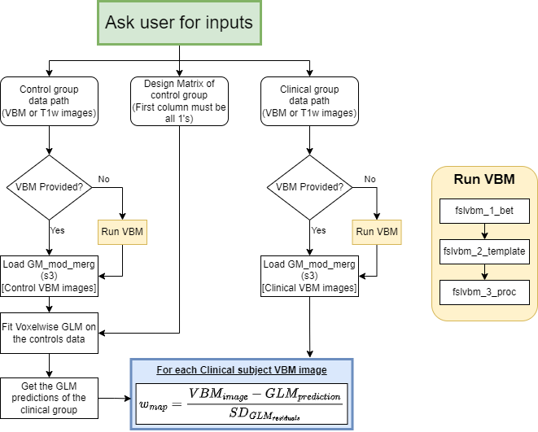

# compneuro-atrophymapping
This repo contains the code used by the Computational Neuroimaging Lab at BioBizkaia HRI to compute the atrophy w-maps using T1w images, aimed to be used in network mapping analyses.

## Pipeline Description

## Prerequisites
In case you have **not run VBM yet**:
- T1w images of a control group
- T1w images of a clinical group
This tool will run VBM on the provided images first.

In case you have already run the VBM pipelines **on each study group**, you could use the following files:
- `GM_mod_merg_sX.nii.gz` of a control group
- `GM_mod_merg_sX.nii.gz` of a clinical group

If not all groups have `GM_mod_merg_sX`, this tool will detect which groups have it and which do not, and will run the VBM pipeline for the groups that do not have it.

## Getting Started

## Usage

### Computing W-score maps
Computes the W-score maps of the study group with respect to the control group.
`compute_wmaps [-h] [-vbmcn CONTROL_VBM_PATH] [-vbmpat STUDYGROUP_VBM_PATH] [-t1cn CONTROL_T1_DIR] [-t1pat STUDYGROUP_T1_DIR] [-dcn CONTROL_DESIGN_MATRIX] [-dpat STUDYGROUP_DESIGN_MATRIX] [-n N_JOBS] -o OUTPUT_DIR`

### Binarizing W-score maps
Binarizes the W-score maps using a threshold. The threshold is applied to negative and positive values separately, producing atrophy (`< -threshold`) and growth (`> +threshold`) maps, respectively.
`binarize_wmaps [-h] --wmap WMAP --threshold THRESHOLD`

### Filtering clusters in binarized W-score maps 
Removes binary clusters that are smaller than a given percentile, respect to the biggest cluster in the map.
`filter_clusters [-h] --clusterim CLUSTERIM --percentile PERCENTILE [--merge MERGE]`

## Outputs
TO BE WRITTEN

## Citing
The methodology followed in this tool is based on the following work: [Ossenkoppele, R., Cohn-Sheehy, B.I., La Joie, R., Vogel, J.W., Möller, C., Lehmann, M., van Berckel, B.N.M., Seeley, W.W., Pijnenburg, Y.A., Gorno-Tempini, M.L., Kramer, J.H., Barkhof, F., Rosen, H.J., van der Flier, W.M., Jagust, W.J., Miller, B.L., Scheltens, P. and Rabinovici, G.D. (2015), Atrophy patterns in early clinical stages across distinct phenotypes of Alzheimer's disease. Hum. Brain Mapp., 36: 4421-4437.](https://doi.org/10.1002/hbm.22927)

We thank Rik Ossenkoppele and Colin Groot-Remmers for sharing their original code and their insights, which helped us to develop this tool.

## License
This project is licensed under the Apache License 2.0 - see the [LICENSE](./LICENSE) file for details

## TODO (highest priority first)
- [ ] Adapt the code to work with joint VBM analysis, not per group
- [ ] Add a section on how to install
- [ ] Dockerize
