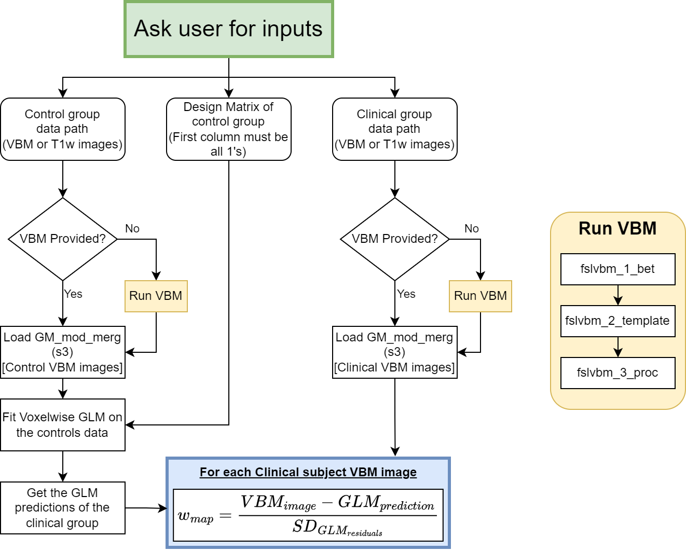

# compneuro-atrophymapping
This repo contains the code used by the Computational Neuroimaging Lab at BioBizkaia HRI to compute the atrophy w-maps using T1w images, aimed to be used in network mapping analyses.

## Pipeline Description

## Prerequisites
In case you have **not run VBM yet**:
- T1w images of a control group
- T1w images of a clinical group
This tool will run VBM on the provided images first.

In case you have already run the VBM pipelines **on each study group**, you could use the following files:
- `GM_mod_merg_sX.nii.gz` of a control group
- `GM_mod_merg_sX.nii.gz` of a clinical group

In case you already run the VBM pipeline but the `GM_mod_merg_sX` is not separated into control/clinical groups, you should provide a partition file with the same dimensions as the `GM_mod_merg_sX` files, where the values are 0 for the control group and 1 for the clinical group. The tool will take care of separating the `GM_mod_merg_sX` image into two different 4D images that 

If not all groups have `GM_mod_merg_sX`, this tool will detect which groups have it and which do not, and will run the VBM pipeline for the groups that do not have it.

## Getting Started

## Usage
compute_atrophy_wmaps.sh [...]

## Outputs

## Citing
...
